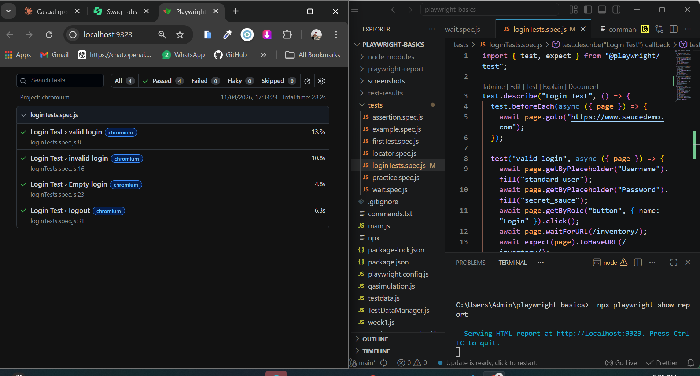

# Tasbeeha's Automation Journey 🌸

Learning Playwright automation from scratch to SDET level.

## Tech Stack

- JavaScript
- Playwright
- Node.js
- GitHub Actions (coming soon)

## What I've Built So Far

### Week 1 — Promises & Async/Await

- Learned promises, resolve, reject
- Learned async/await and try/catch
- Built qaSimulation.js — simulated full browser automation flow

### Week 2 — Array Methods, Destructuring, Modules

- Learned forEach, map, filter, find
- Learned destructuring and modules
- Built testDataManager.js — load and filter test data

### Week 3 — Playwright Basics

- Installed Playwright
- Learned locators — getByRole, getByText, getByPlaceholder
- Learned assertions — toBeVisible, toHaveURL, toHaveTitle
- Built first real login automation test

### Week 4 — Assertions, Waits, Test Structure

- Learned all assertions
- Learned waitForURL, waitForSelector
- Learned describe() and beforeEach()
- Built structured login test suite — 3 tests

## Test Results

## Progress

- [x] Week 1 — JavaScript Foundations
- [x] Week 2 — Array Methods & Modules
- [x] Week 3 — Playwright Basics
- [x] Week 4 — Test Structure
- [ ] Week 5 — Page Object Model
